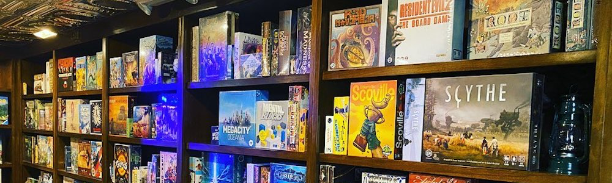

[![License][badge-mit]][license]
![Project-status][status-active]

<h1>Board Games Recommendation System</h1>

This is a project of recommendation system for board games, based on information from boardgamegeek.com

 :hammer_and_wrench: Realised: data scraping, collaborative filtering, item-based recommendation, hybrid recommendation system.
 

<h2>Tech-skills:</h2>

[status-active]: https://img.shields.io/badge/project%20status-active-brightgreen?style=for-the-badge&logo=appveyor.svg
[status-on-hold]: https://img.shields.io/badge/project%20status-on%20hold-yellow?style=for-the-badge&logo=appveyor.svg
[status-completed]: https://img.shields.io/badge/project%20status-completed-blueviolet?style=for-the-badge&logo=appveyor.svg
[status-cancelled]: https://img.shields.io/badge/project%20status-cancelled-red?style=for-the-badge&logo=appveyor.svg
[badge-mit]: https://img.shields.io/badge/License-MIT-blue?style=for-the-badge&logo=appveyor.svg
[license]: https://github.com/Fedorov-Nikita/Board-Games/blob/main/LICENSE.md

[badge-colab]: https://img.shields.io/badge/open%20in%20Colab-F9AB00?style=for-the-badge&logo=googlecolab&color=525252
[colab]: https://drive.google.com/
[badge-demo]: https://img.shields.io/badge/try%20demo-525252?style=for-the-badge&logo=Streamlit
[demo]: https://streamlit.io/

<!---

![Project-status][status-on-hold]
![Project-status][status-completed]
![Project-status][status-cancelled]

--->
